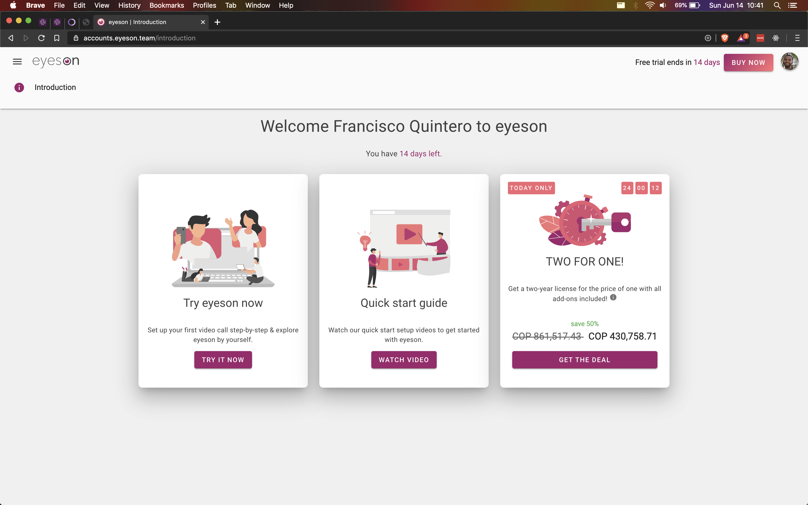
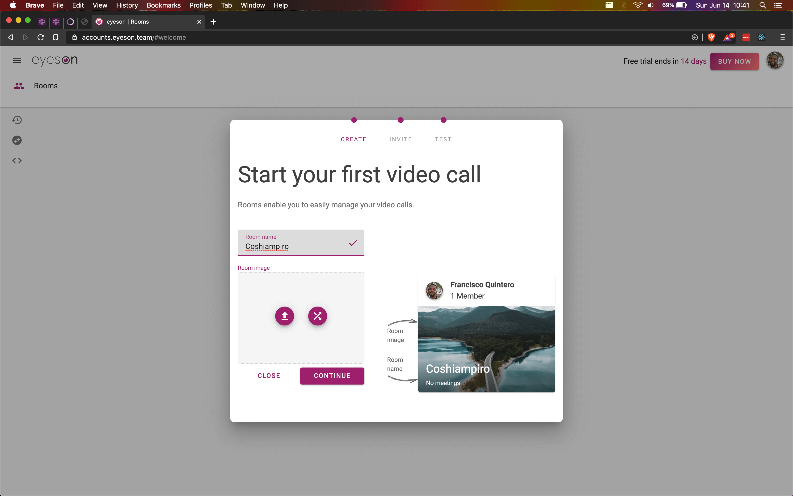
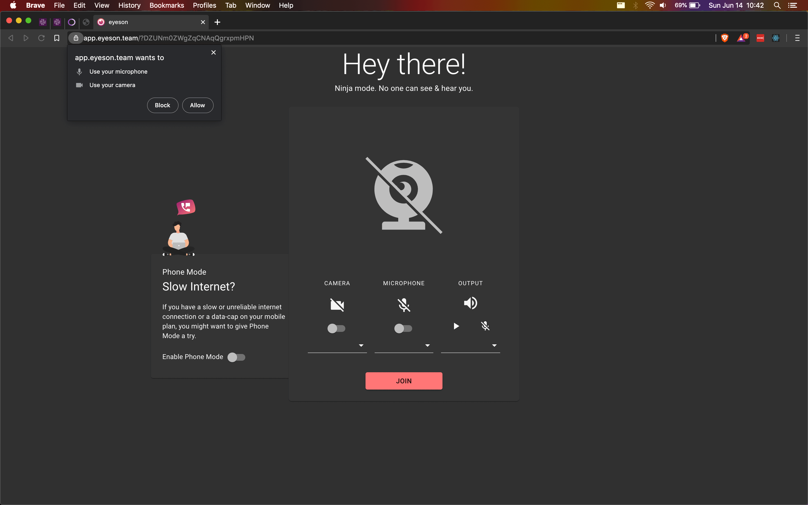
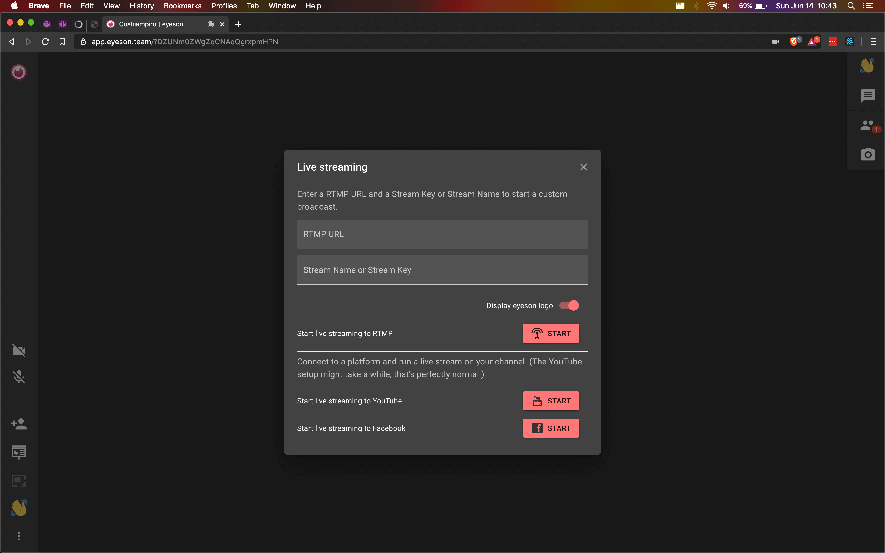
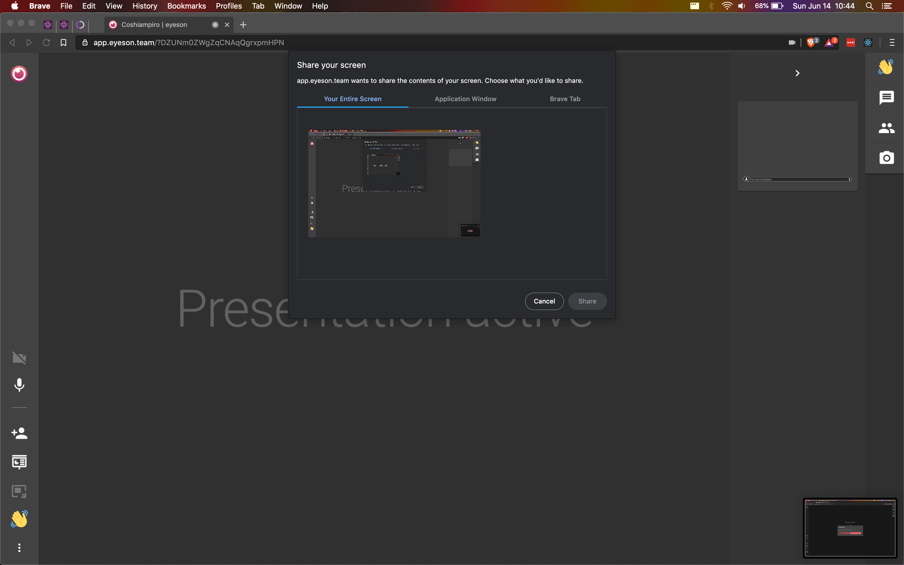
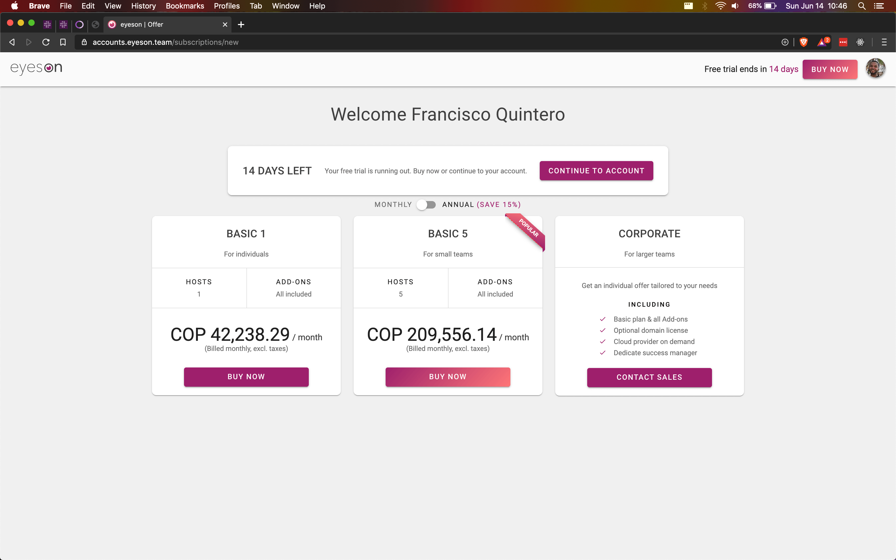

# Evaluando Eyeson

No recuerdo plenamente como llegué a Eyeson pero conozco de su existencia de hace ya un par de años.

A continuación algunos detalles del servicio que pinta como una buena alternativa.

## Registro

Así como Join Me, Eyeson no ofrece capa gratuita y en cambio ofrece 14 días de prueba para conocer todo lo básico y esperado.

Una vez nos hayamos registrados, podemos seguir una especie de _wizard_ para completar el mismo y crear la primera sala.

Detalle es el nivel de personalización que puede tener la creación de una sala que no se da en otros servicios.

## Período de Prueba

Dentro de los 14 días de prueba contamos con todos los juguetes ofrecidos por Eyeson para probar el servicio:

- Vídeo llamada
- Ingreso por enlace
- Chat
- Control de usuarios
- Compartir pantalla
- Grabación de llamada
- Transmisión de llamada

Y sí que sorprende ver todo lo que podemos hacer y usar en Eyeson lo cual a su vez evidencia lo fuerte y estable que está WebRTC hoy en día y como el navegador cada vez es una herramienta muy fuerte en las comunicaciones y la colaboración.

## Características

El nivel de personalización de la interfaz, lo bien cuidada que está y a su vez lo suficientemente simple es un claro indicio del nivel de calidad que pone Eyeson a su producto y el cual es bastante decente.

La cantidad de opciones para usar también se hacen suficientes e importantes porque no solo basta con abrir un canal de audio y vídeo sino poder controlar y hacer otras cosas.

Más sorprendente aún es poder hacer una transmisión de la llamada. Las dos formas que conozco de tranmisión de vídeo son usando YouTube o Twitch usando un software de terceros llamado OBS.

Acá vemos que Eyeson nos permite desde el mismo navegador lograr este propósito.

Y si bien tiene esta característica tan avanzada, no descuida otras igual de importantes como compartir pantalla que también es implementada de manera nativa, es decir, sin necesidad de plugins o complementos.

## Lo que no se pudo probar

A diferencia de Join Me y sus 14 días de pruebas, el período de prueba de Eyeson permite probar todo para tener una mejor sensación de cómo funciona el servicio y así tomar la decisión de adquirirlo o no.

Y vaya que es importante porque es un compromiso serio pagar el servicio y es bueno poder probarlo a fondo, en general.

